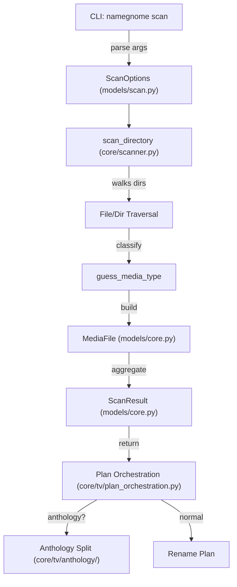

# NameGnome Scan Logic: Current State (June 2024)

## Overview
This document provides a comprehensive accounting of the current Scan logic in NameGnome, including:
- What the Scan phase does
- Where the logic lives
- Why it is structured this way
- How the scan process flows from CLI to plan
- Known issues and test coverage
- **The full set of Scan rules and requirements (see below)**

---

## 1. What: Purpose of Scan

The Scan phase is responsible for:
- Recursively traversing a user-specified directory
- Identifying media files (TV, Movie, Music) using filename patterns, extensions, and directory hints
- Building a list of `MediaFile` objects with metadata (path, size, type, season, episode, etc.)
- Returning a `ScanResult` object for downstream planning/renaming

---

## 2. Where: Key Files & Modules

- `src/namegnome/core/scanner.py`: Main scan logic, directory traversal, file classification
- `src/namegnome/models/scan.py`: ScanOptions model (user/platform scan config)
- `src/namegnome/models/core.py`: MediaFile, MediaType, ScanResult models
- `src/namegnome/core/tv/scan_helpers.py`: TV-specific helpers for extracting show/season/year
- `src/namegnome/core/tv/plan_orchestration.py`: Consumes scan results to build rename plans
- `src/namegnome/core/tv/anthology/`: Anthology-specific logic for multi-episode files
- `tests/core/test_scanner.py`: Unit tests for scan logic

---

## 3. Why: Design Rationale

- **Extensibility:** Modular helpers and models allow for platform-specific rules and future media types.
- **Robustness:** Handles hidden files, non-ASCII, and edge cases. Skips non-media and sidecar files.
- **Cross-platform:** Uses pathlib and absolute paths for safety.
- **Testability:** Extensive test suite covers edge cases, regressions, and platform quirks.

---

## 4. How: Scan Flow Diagram

---

## 5. Scan Logic: Step-by-Step

1. **CLI parses user input** and builds a `ScanOptions` object.
2. **scan_directory** is called with the root directory and options.
3. **Directory traversal** recursively walks the file tree, skipping hidden/sidecar files unless configured.
4. **File classification** uses extension, filename patterns, and directory hints to guess media type.
5. **MediaFile objects** are created for valid media files, with metadata extracted (season, episode, etc.).
6. **ScanResult** aggregates all found media files, errors, and stats.
7. **Plan orchestration** consumes the ScanResult to build a rename plan, using anthology logic if needed.

---

## 6. Anthology/TV Special Handling
- TV/Anthology logic (core/tv/anthology/) attempts to split multi-episode files into correct episode spans and titles.
- Uses fuzzy matching, token overlap, and fallback heuristics.
- Known issues: inconsistent episode span formatting, edge-case mismatches, and some stubbed logic.

---

## 7. Known Issues & Test Coverage
- See test failures in `tests/core/test_scanner.py` and anthology regression tests.
- Main issues: episode span formatting, ambiguous mapping, stubbed/fallback logic, and logging gaps.

---

## 8. Next Steps
- Identify and refactor stubs/legacy code in scan/anthology logic.
- Standardize episode span formatting and matching.
- Improve logging and error reporting for edge cases.
- Ensure all scan logic is fully covered by tests and matches expected behaviors.

---

# NameGnome Scan Phase: Rules & Requirements (Source of Truth)

This section defines the **requirements, expected behaviors, and rules** for the Scan phase in NameGnome. It is the authoritative reference for all contributors and AI assistants. Update as needed to reflect evolving standards and edge cases.

---

## 1. General Requirements
- Recursively scan a user-specified directory for media files.
- Identify and classify files as TV, Movie, Music, or Unknown using:
  - File extensions (must match supported media types)
  - Filename patterns (e.g., S01E01, 1x01, etc.)
  - Directory hints (e.g., "TV Shows", "Movies")
- Skip non-media, sidecar, and hidden files (unless configured otherwise).
- Build a list of MediaFile objects with all relevant metadata.
- Return a ScanResult with all found media files, errors, and stats.

---

## 2. Standard Case Behaviors
- **TV Shows:**
  - Extract show name from filename, parent directory, or explicit config.
  - Detect season number, episode number, and episode title from filename (e.g., S01E01, 1x01, etc.).
  - Query TVDB (on failure falling back to TMDB, then OMDb) to get cannonical episode numbering and titles by season
    - If a Show Name returns multiple series, prompt the user for clarificaton (exe: Danger Mouse => Danger Mouse (1989), Danger Mouse (2015))
  - Parse episode titles (if detected) from input filenames
    - ONLY if no episode titles are detected, fall back to episode numbering.
    - If only numbers are detected in file names, we can safely assume they are episode numbers
  - **NEW (Sprint 2):** If episode titles are missing, the planner uses file duration and canonical episode runtimes to assign episode spans (or singles) to files. This duration-based assignment is robust for anthology and non-anthology shows, and is attempted before manual fallback.
  - Support multi-episode spans in files (e.g., S01E01-E02, S01E01-E03, etc.) in both anthology and non-anthology format shows. (e.g., a non-anthology show file may comprise two or more canonical episodes if the database treats a multi-part episode as separate canonical episodes. Superman The Animated Series has a triple-length first episode, that is normally syndicated into 3 separate episodes per TVDB)
- **Movies:**
  - Detect movie year from filename (e.g., "Inception (2010)").
  - Extract movie title from filename or parent directory.
- **Music:**
  - Detect track/album/artist from directory structure and filename.
- **Unknown:**
  - Gracefully fail and inform the user they must 
    - indicate a Media Type before proceeding
    - clarify Show Name or Season if these can't be parsed by earlier steps
    - if not marked as an anthology series, and the canonical episode list is roughly double in length (or greater) than the number of target directory files, ask user if this is an anthology series (files contain spanned canonical episodes) before proceeding. (A user may not have all episodes of a season, but that doesn't mean we )

---

## 3. Edge Case Handling
- **Hidden files/directories:**
  - Skip by default; include if `include_hidden` is set.
- **Non-ASCII filenames:**
  - Must be supported and not cause errors.
- **Sidecar/subtitle/artwork files:**
  - Always skipped (e.g., .srt, .nfo, .jpg, .png).
    - TODO: add support for subtitles, following Plex naming conventions 
- **Ambiguous or malformed filenames:**
  - If unable to confidently classify, mark as manual or unknown.
- **Anthology/multi-episode files:**
  - Attempt to parse and split episode titles from input filenames and map to correct cannonical episode titles.
    - We are seeking to conform input to canonical episode numbering and titles!
      - Always assume input filename numbering is wrong if episode titles are detected!
      - A user always wants to conform to the API response so the correct metadata is mapped in the Media Server client (exe: Plex needs TV Shows to match TVDB or they will mismatch metadata)
  - If no titles are detected, it is safe to assume that input episode numbering is correct, and we can pair titles from matching canonical episode numbering
  - There may situations where a user will know that their sequential input numbering is correct, but their attached titles are incorrect (exe: Sonarr will rename files based off TVDB, even though episodes are spans. Users will know numbering is correct, but titles are incorrect)
    - if this is the case we need to
      - check the API response for episode length
      - Assume anthology series are ~20-30 minutes in length
      - Iteratively progress from the first numerical input file and 
        - iteratively pair canonical half-length episodes as spans (exe: INPUT: [EP1, EP2], OUTPUT: [E01-E02, E03-E04])
        - Do not span iteratively discovered double-length episodes (exe: if input EP3 is 22 minutes instead of 11 => E05)
  - If still too ambiguous, mark for manual review.
- **Nonexistent or non-directory paths:**
  - Raise clear errors and do not proceed.

---

## 4. Cross-Platform & Safety Rules
- All paths must be absolute.
- All logic must work on Windows, macOS, and Linux.
- No OS-specific path or file handling.
- Never modify or move files during scan (scan is read-only).

---

## 5. Extensibility & Modularity
- All scan logic must be modular and testable.
- TV/movie/music rules must be easily extendable for new platforms or naming conventions.
- All configuration must be explicit via `ScanOptions`.

---

## 6. Testability & Coverage
- Every function/class must have:
  - 1 expected-flow test
  - 1 edge case test
  - 1 failure case test
- All edge cases and regressions must be covered by tests.
- Coverage threshold: 80% minimum.

---

## 7. Error Handling & Reporting
- All errors (file access, parse failures, etc.) must be logged and included in `ScanResult.errors`.
- No silent failures.
- Manual/ambiguous cases must be clearly flagged for downstream review.

---

## 8. Naming & Metadata Rules
- Follow the MEDIA-SERVER FILE-NAMING & METADATA GUIDE for all pattern matching and classification.
- Use platform presets and naming conventions for all output and classification.

---

## 9. CLI/UX Rules
- All scan options must be available via CLI flags.
- Output must be clear, colorized (unless disabled), and suitable for both human and script consumption (JSON mode).

---

## 10. Documentation & Maintainability
- All scan logic must be documented with module-level and function-level docstrings.
- All rules, edge cases, and platform-specific behaviors must be documented in this file and/or the codebase.

---

## 11. TO-DO
- Absolute numbering leveraging client AniList and AniDB
  - reimplement AniDB client (lost at some point in refactoring)
- Subtitle support for Movies and TV Shows
- Movie logic
- Music logic

*Update this file as requirements evolve. This is the single source of truth for Scan phase rules and expected behavior.*
