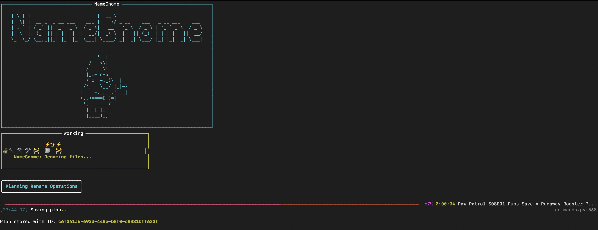
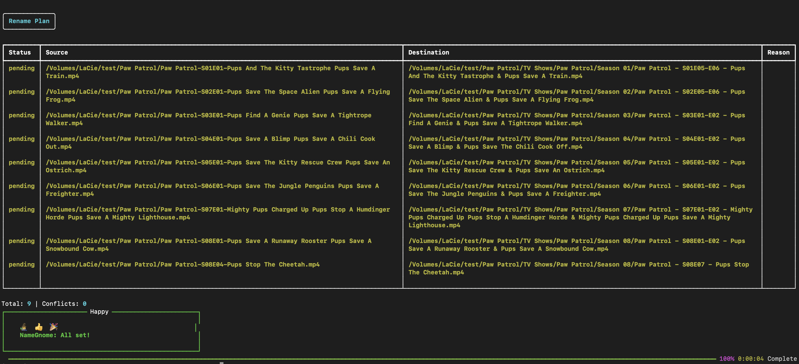
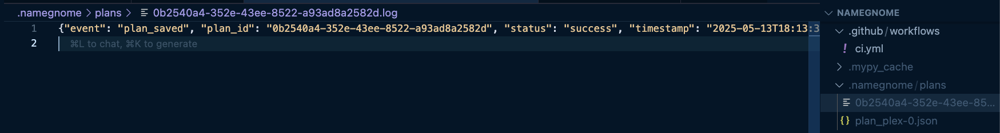
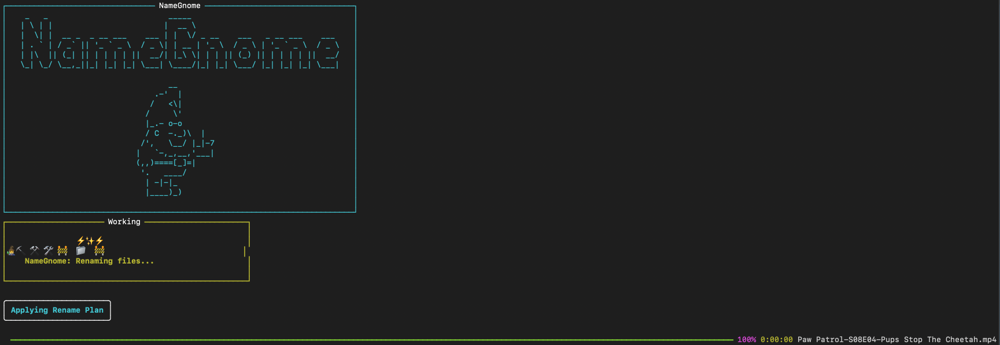
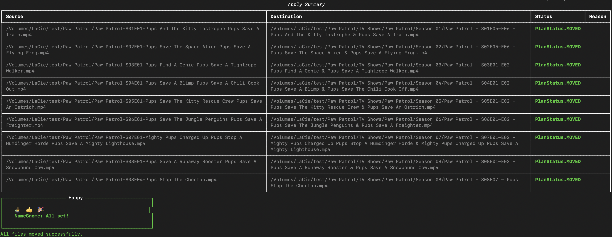
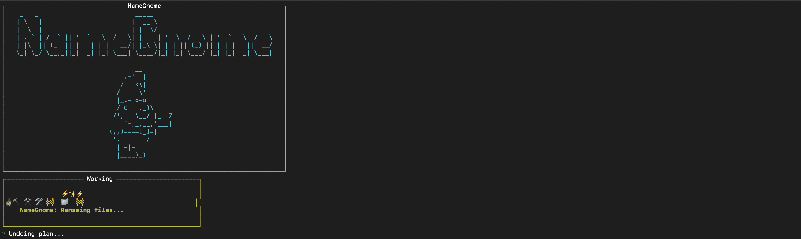
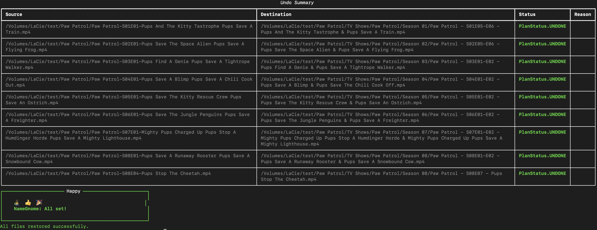

# NameGnome End-to-End Demo

This demo walks through the full NameGnome workflow: scanning, applying, and undoing media file renames. Use this as a script for live demos, documentation, or presentations.

---

## Prerequisites

- NameGnome installed and available in your PATH
- Python ≥3.12, Typer, Rich, and all dependencies installed
- Test media files in a demo directory (e.g., `~/DemoMedia/TV/Paw Patrol`)
- (Optional) Ollama running for LLM features
- Terminal with color support (for best Rich output)

---

## 1. Scan Media Files

**Command:**
```sh
namegnome scan "~/DemoMedia/TV/Paw Patrol" --media-type tv --anthology
```

**Expected Output:**
- Rich table of planned renames
- Progress bar for file scanning
- Summary of conflicts/manual items (if any)

**Screenshot:**



---

## 2. Review the Plan

- Open the generated plan file (e.g., `~/.namegnome/plans/<PLAN_ID>.json`)
- Optionally, inspect the plan in a text editor or with `cat`

**Screenshot:**


---

## 3. Apply the Rename Plan

**Command:**
```sh
namegnome apply <PLAN_ID> --yes
```

**Expected Output:**
- Progress bar for file moves
- Rich summary table of results (MOVED, SKIPPED, FAILED)
- Success message and next steps

**Screenshot:**



---

## 4. Undo the Rename Plan

**Command:**
```sh
namegnome undo <PLAN_ID> --yes
```

**Expected Output:**
- Progress bar for undoing moves
- Rich summary table of results (UNDONE, FAILED)
- Success message

**Screenshot:**


