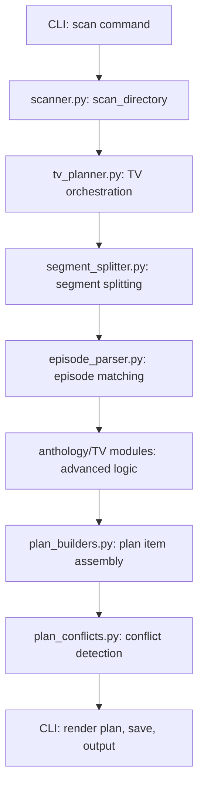

[](https://github.com/DouglasMacKrell/namegnome/actions)
[](https://github.com/yourusername/namegnome)

See [docs/architecture.md](docs/architecture.md) for a full architecture diagram.

# NameGnome

A command-line tool for organizing and renaming media files according to platform-specific conventions (e.g., Plex, Jellyfin).

## 📚 Documentation

- [**Architecture Overview**](docs/architecture.md): High-level design and component diagram.
- [**Filesystem Operations**](docs/fs-operations.md): Atomic, cross-platform file moves and guarantees.
- [**Apply & Undo Engines**](docs/apply-undo.md): Transactional renaming, rollback, and CLI/Python usage.
- [**Hashing & Integrity**](docs/hashing.md): SHA-256 utility, integrity checks, and skip-identical logic.
- [**Progress Bars & Logging**](docs/progress-logging.md): Rich CLI UX, progress bars, spinners, and audit logging.
- [**Integration Testing**](docs/integration-testing.md): End-to-end test philosophy, structure, and guarantees.
- [**CLI Command Reference**](docs/cli-commands.md): All commands, flags, usage, exit codes, and advanced options.
- [**LLM Features & Usage Guide**](docs/llm.md): Model install, selection, troubleshooting.
- [**Provider Setup & API Keys**](docs/providers.md): How to configure API keys for metadata/artwork providers.
- [**Known Issues & Troubleshooting**](docs/KNOWN_ISSUES.md): Common issues and solutions.
- [**Quickstart Guide**](docs/quickstart.md): First-time setup and usage for beginners.

## Features

- Scan directories for media files
- Support for TV shows, movies, and music (album/track)
- Platform-specific naming conventions
- Multi-segment episode handling
- Explicit media information control
- JSON output support
- File integrity verification (SHA-256)
- **Apply & Undo engine**: Transactional, reversible renames. Undo now also removes any empty directories created by apply, restoring your directory structure to its pre-apply state (default and safe).
- **Rich progress bars & logging**: CLI feedback and audit trail
- **Integration tests**: End-to-end, cross-platform
- **Pluggable metadata/artwork providers**: TMDB, TVDB, MusicBrainz, Fanart.tv, TheAudioDB (API compliant)
- **Metadata cache**: SQLite-backed cache for provider lookups, reducing API calls and enabling offline scans
- **Metadata-aware rule engine**: Naming rules now use provider metadata (e.g., movie year, TV episode title) for more accurate and platform-compliant renaming
- **Async Ollama wrapper**: Provides a robust async interface to a local Ollama server for
  streaming LLM inference, error handling, and future AI-powered features.
- **Prompt template system**: Reusable Jinja2-based prompt template system for LLM workflows (strict loader, editable templates, orchestrator, 100% TDD)
- **Anthology episode splitting**: Robust, user-driven LLM-based splitting of multi-episode TV files. Supports S01E01E02, E01-E02, 1x01-1x02, and real-world anthology filenames. Only triggers with --anthology flag.
- **LLM confidence/manual flag**: Prevents low-confidence AI guesses from auto-renaming. Items below threshold are flagged manual, highlighted in bright red, and require user review. CLI exits with code 2 if manual items are present.
- **LLM model selection**: Supports Llama 3 8B (Meta) as default, Mistral 7B as lightweight fallback. See [LLM Features & Usage Guide](docs/llm.md) for install, usage, and troubleshooting.
- **Rich CLI UX**: Colorful tables, progress bars, and spinners powered by Rich (disable with `--no-rich` or `NAMEGNOME_NO_RICH`)

## Project Structure

```
namegnome/                  # Project root
├── src/                   # Source code directory
│   └── namegnome/        # Package directory
│       ├── cli/         # CLI commands and UI
│       ├── core/        # Core renaming engine
│       ├── rules/       # Platform-specific rules
│       ├── metadata/    # Metadata providers
│       ├── fs/          # Filesystem operations
│       └── prompts/     # LLM prompt templates and orchestrator (Jinja2-based)
├── tests/               # Test directory (mirrors src structure)
├── docs/               # Documentation
│   ├── fs-operations.md
│   ├── apply-undo.md
│   ├── hashing.md
│   ├── progress-logging.md
│   ├── integration-testing.md
│   ├── cli-commands.md
│   └── architecture.md
├── config/            # Configuration files and scripts
│   └── scripts/       # Development and utility scripts
├── README.md          # Project overview
├── PLANNING.md        # Project planning and vision
└── TASK.md           # Current tasks and sprints
```

## How TV Scan Works: Architecture & Module Map

The `namegnome scan` command is the entry point for analyzing media files, extracting metadata, and planning renames. For TV shows—especially anthologies and multi-segment episodes—the logic is now highly modular, with each part handling a specific responsibility. This design enables robust handling of edge cases, platform-specific rules, and future extensibility.

### Why This Modular Approach?
- **Maintainability:** Each module has a single responsibility, making it easier to test, debug, and extend.
- **Testability:** Fine-grained modules allow for targeted regression and edge-case tests.
- **Extensibility:** New platforms, naming rules, or episode-matching strategies can be added without monolithic rewrites.
- **Reliability:** Isolating logic reduces the risk of regressions and makes the scan pipeline more robust.

---

### Scan Pipeline: High-Level Flow



- **A:** User runs the scan command from the CLI.
- **B:** `scanner.py` finds and classifies media files.
- **C:** `tv_planner.py` orchestrates the TV scan/plan process.
- **D:** `segment_splitter.py` splits filename stems into segments.
- **E:** `episode_parser.py` and anthology modules match segments to canonical episode titles.
- **F:** Anthology-specific modules handle complex multi-segment and edge cases.
- **G:** `plan_builders.py` assembles the final rename plan.
- **H:** `plan_conflicts.py` detects and resolves conflicts.
- **I:** CLI presents the plan to the user.

---

### Key Modules and Their Roles

- **scanner.py:** Recursively scans directories, classifies files, and builds the initial list of media files for planning.
- **tv_planner.py:** Orchestrates the TV scan/plan pipeline. Delegates to segment splitting, episode matching, and anthology logic as needed.
- **segment_splitter.py:** Splits filename stems into episode segments using delimiters, moniker patterns, and fuzzy heuristics.
- **episode_parser.py:** Matches segments to canonical episode titles using fuzzy matching, token overlap, and rare noun analysis.
- **anthology/tv_anthology_match.py:** Specialized matching logic for anthology/multi-segment files. Ensures strict span-matching.
- **anthology/tv_anthology_split.py:** Advanced splitting logic for anthology files, including fallback strategies.
- **anthology/tv_anthology_orchestration.py:** Orchestrates the creation of plan items for anthology matches.
- **plan_builders.py:** Assembles plan items from matched episodes and segments.
- **plan_conflicts.py:** Detects and resolves conflicts in the planned renames.
- **fuzzy_matcher.py:** Provides fuzzy matching utilities for episode title matching.
- **utils.py:** Shared utilities for title sanitization, normalization, and other common TV logic.

---

### How It All Connects

- The **scan** command starts in `scanner.py`, which finds files and classifies them.
- For TV files, `tv_planner.py` takes over, orchestrating the process.
- Filenames are split into segments by `segment_splitter.py` (and, for anthologies, by `tv_anthology_split.py`).
- Each segment is matched to canonical episode titles by `episode_parser.py` and, for anthologies, by `tv_anthology_match.py`.
- Anthology-specific orchestration and fallback logic live in `core/tv/anthology/`.
- Plan items are built and checked for conflicts before being presented to the user.

---

**For further details, see [`SCAN.md`](SCAN.md) for a comprehensive, always-current breakdown of the scan pipeline, edge cases, and design rationale.**

## Installation

### Prerequisites
- **Python**: 3.12 or higher
- **Supported OS**: Windows, macOS, Linux (cross-platform tested)
- **Recommended**: [pipx](https://pypa.github.io/pipx/) for isolated CLI installs

### Install via pip
```bash
pip install namegnome
```

### Install via pipx (recommended)
```bash
pipx install namegnome
```

### Verify installation
```bash
namegnome --help
```

### Provider API Key Setup

Some features (metadata/artwork lookups) require free API keys from third-party providers.  
To get started:

1. Copy `.env.example` to `.env` in your project root:
   ```bash
   cp .env.example .env
   ```
2. Fill in your API keys for the providers you wish to use.  
   See [docs/providers.md](docs/providers.md) for a full list of supported providers and setup links.

- If a key is missing, only the related feature will be skipped (e.g., no artwork if `FANARTTV_API_KEY` is missing).
- Never commit your real `.env` file or API keys to version control.

## Project Highlights

- **Zero-click happy-path**: Scan, preview, and rename in one command
- **Platform presets**: Out-of-the-box support for Plex, Jellyfin, Emby, Navidrome, and more
- **Fuzzy LLM assist**: Handles anthology episodes, ambiguous titles, and edge cases using local LLMs (Ollama)
- **Safe by default**: Dry-run planning, conflict detection, and one-command rollback
- **Rich CLI UX**: Colorful tables, progress bars, and spinners powered by Rich (disable with `--no-rich` or `NAMEGNOME_NO_RICH`)
- **Extensible**: Pluggable metadata providers and naming rules
- **Cross-platform**: Works on Windows, macOS, and Linux

## Usage

NameGnome is a CLI tool. All commands and options are available via `namegnome --help`.

### Basic Scan
Scan a directory for media files and preview the proposed renames (at least one media type is required):
```bash
namegnome scan /path/to/media/files --media-type tv
```
You can specify multiple types:
```bash
namegnome scan /path/to/media/files --media-type tv --media-type movie
```

### Apply a Rename Plan
Apply a previously generated plan (by plan ID or by specifying the full path to a plan file in `~/.namegnome/plans/`):
```bash
namegnome apply <plan-id> --yes
namegnome apply ~/.namegnome/plans/<plan-id>.json --yes
```
- Use `--yes` to skip confirmation.
- Plan files are stored in `~/.namegnome/plans/` (in your home directory) by default.

### Undo a Rename Plan
Rollback a previously applied plan (by plan ID or by specifying the full path to a plan file in `~/.namegnome/plans/`):
```bash
namegnome undo <plan-id> --yes
namegnome undo ~/.namegnome/plans/<plan-id>.json --yes
```
- Restores all files to their original locations if possible.
- Updates plan status and prints a summary table.
- After restoring files, undo will also remove any empty directories created by apply, so your library is left exactly as it was before the rename (including removing hidden files like .DS_Store).
- If the original source file already exists, undo will fail and not overwrite.
- If the destination file is missing (already undone), undo will fail for that item.

**Example:**
```sh
namegnome undo 123e4567-e89b-12d3-a456-426614174000
```
You will be prompted for confirmation unless you pass `--yes`:
```sh
Are you sure you want to undo the plan 123e4567-e89b-12d3-a456-426614174000? [y/N]: y
Restoring /path/to/moved1.txt -> /path/to/original1.txt
Restoring /path/to/moved2.txt -> /path/to/original2.txt
[green]Undo completed for plan: 123e4567-e89b-12d3-a456-426614174000[/green]
```

### Platform Selection
Choose a target platform to apply its naming conventions:
```bash
namegnome scan /path/to/media/files --media-type tv --platform plex
namegnome scan /path/to/media/files --media-type tv --platform jellyfin
```

### Provider Selection
Choose which metadata provider to use for lookups (TV, movie, or music):
```bash
# Use TVDB for TV shows (default)
namegnome scan /path/to/media/files --media-type tv --provider tvdb
# Use TMDB for movies
namegnome scan /path/to/media/files --media-type movie --provider tmdb
# Use OMDb as a fallback
namegnome scan /path/to/media/files --media-type movie --provider omdb
# Use MusicBrainz for music (default for music)
namegnome scan /path/to/media/files --media-type music --provider musicbrainz
# Use TheAudioDB as a fallback for music
namegnome scan /path/to/media/files --media-type music --provider theaudiodb
```
Available provider options: `tvdb`, `tmdb`, `omdb`, `musicbrainz`, `theaudiodb`.

If not specified, the default provider is `tvdb` for TV, `tmdb` for movies, and `musicbrainz` for music. The CLI will fall back to other providers automatically if the primary provider fails or is missing data.

### Media Type Filtering
Limit scan to specific media types (required):
```bash
# TV only
namegnome scan /path/to/media/files --media-type tv
# Movies only
namegnome scan /path/to/media/files --media-type movie
# Both
namegnome scan /path/to/media/files --media-type tv --media-type movie
```

### TV Show Options
- `--show-name "Show Title"`: Override detected show name
- `--anthology`: Handle multi-segment episodes (e.g., Paw Patrol)
- `--adjust-episodes`: Fix episode numbering if files are in correct order but misnumbered
- `--media-type tv`: Required for all TV show scans

### Movie Options
- `--movie-year 2023`: Specify release year for movie files
- `--artwork`: Download and cache high-quality poster artwork for each movie using
  Fanart.tv (requires FANARTTV_API_KEY in your .env)

### Music Options
- `--media-type music`: Scan and organize music files (albums/tracks)

### Output & Verification
- `--json`: Output results as JSON
- `--no-color`: Disable colored output (for logs/CI)
- `--verify`: Compute and store SHA-256 checksums for file integrity
- `--llm-model "model-name"`: Use a specific LLM for fuzzy matching
- `--no-cache`: Bypass the metadata cache and force fresh API calls (useful for debugging or when you want the latest data)
- Low-confidence LLM results are flagged manual and require user review.
- Manual items are highlighted in bright red in the diff table.
- CLI exits with code 2 if any manual items are present in the plan.

### Music Metadata Lookup
- Music files are matched using MusicBrainz (API compliant: 1 req/sec, custom User-Agent)
- Example:
```bash
namegnome scan /media/Music --media-type music
```

### Cleaning Up Old Plans
Delete old rename plans from the NameGnome plan store:
```bash
namegnome clean-plans [--keep N] [--yes]
```
- By default, deletes all plans in `~/.namegnome/plans/` (home directory).
- Use `--keep N` to keep the N most recent plans.
- Use `--yes` to skip the confirmation prompt.

**Examples:**
```bash
# Delete all plans:
namegnome clean-plans

# Keep the 5 most recent plans:
namegnome clean-plans --keep 5

# Delete all plans without confirmation:
namegnome clean-plans --yes
```

## List and Inspect Plans

You can list all available plan files and inspect their details:

```sh
namegnome plans                # List all plans
namegnome plans --status       # Show status summary for each plan
namegnome plans --show-paths   # Show full file paths
namegnome plans <PLAN_ID>      # Show details for a specific plan
namegnome plans --json         # Output as JSON for scripting
namegnome plans --latest       # Show the most recent plan
```

## Technology Stack

- **Python 3.12+**: Modern language features and performance
- **Typer**: Declarative CLI framework
- **Rich**: Beautiful CLI output (tables, spinners, progress bars)
- **Pydantic v2**: Data validation and serialization
- **httpx + asyncio**: Async HTTP for metadata providers
- **pytest**: Testing framework (80%+ coverage enforced)
- **ruff-format (Black-compatible), ruff, mypy**: Formatting, linting, and static typing
- **Ollama**: Local LLM server for fuzzy matching and edge-case handling
- **Jinja2**: Prompt template system for LLM workflows
- **SQLite**: Local cache for metadata and LLM responses
- **TMDB, TVDB, MusicBrainz, OMDb, Fanart.tv, AniList, TheAudioDB**: Pluggable metadata/artwork providers (API compliant)
- **pipx**: Recommended for isolated CLI installs

## Metadata Providers

NameGnome supports pluggable metadata providers:
- **TMDB**: Movies and TV metadata
- **TVDB**: TV episode and series metadata
- **MusicBrainz**: Music album/track/artist metadata
  - Fully compliant with [MusicBrainz API](https://musicbrainz.org/doc/MusicBrainz_API):
    - 1 request/sec rate limiting
    - Custom User-Agent header
- **OMDb**: Supplements TMDB with IMDb rating and full plot. Requires a free or patron API key (see [OMDb API](https://www.omdbapi.com/)). Free keys are limited to 1,000 requests/day. OMDb fields are only used if missing from TMDB, and TMDB always takes priority.
- **Fanart.tv**: High-quality poster artwork for movies (by TMDB ID). Requires a free
  API key (see [Fanart.tv API](https://fanart.tv/api-docs/)). Artwork is downloaded
  and cached locally when the `--artwork` flag is used.
- **AniList**: Anime metadata with absolute episode numbering support. Uses AniList's GraphQL API
  which does not require authentication.

## OMDb API Key Setup

- Register for a free OMDb API key at [omdbapi.com](https://www.omdbapi.com/apikey.aspx).
- Add `OMDB_API_KEY` to your `.env` file (never hard-code keys).
- If the key is missing, OMDb supplementation will be skipped.

## Fanart.tv API Key Setup

- Register for a free Fanart.tv API key at [fanart.tv/api](https://fanart.tv/api/).
- Add `FANARTTV_API_KEY` to your `.env` file (never hard-code keys).
- If the key is missing, the `--artwork` flag will be ignored and no artwork will be
  downloaded.

## Attribution

<p align="center">
  <a href="https://thetvdb.com">
    
  </a><br>
  Metadata provided by <a href="https://thetvdb.com">TheTVDB</a>.<br>
  Please consider adding missing information or subscribing.
</p>

<p align="center">
  <a href="https://www.themoviedb.org/">
    
  </a><br>
  This product uses the TMDB API but is not endorsed or certified by TMDB.<br>
  <a href="https://www.themoviedb.org/documentation/api/terms-of-use">TMDB API Terms of Use</a>
</p>

<p align="center">
  <a href="https://musicbrainz.org/">
    
  </a><br>
  Music metadata provided by <a href="https://musicbrainz.org/">MusicBrainz</a>.
</p>

<p align="center">
  <a href="https://www.omdbapi.com/">
    
  </a><br>
  Movie metadata supplemented by <a href="https://www.omdbapi.com/">OMDb API</a>.<br>
  <a href="https://www.omdbapi.com/legal.htm">OMDb API Terms of Use</a>
</p>

<p align="center">
  <a href="https://fanart.tv/">
    
  </a><br>
  Artwork provided by <a href="https://fanart.tv/">Fanart.tv</a>.<br>
  <a href="https://fanart.tv/terms/">Fanart.tv API Terms of Use</a>
</p>

<p align="center">
  <a href="https://anilist.co/">
    
  </a><br>
  Anime metadata provided by <a href="https://anilist.co/">AniList</a>.<br>
  <a href="https://anilist.gitbook.io/anilist-apiv2-docs/">AniList GraphQL API</a>
</p>

## Examples

### Organizing a TV Show with Multi-Segment Episodes
```bash
namegnome scan /media/TV/PawPatrol \
  --show-name "Paw Patrol" \
  --anthology \
  --adjust-episodes
```

### Organizing Movies with Explicit Year
```bash
namegnome scan /media/Movies \
  --media-type movie \
  --movie-year 2023
```

### Complex Organization (Plex, TV + Movies, JSON output, verification)
```bash
namegnome scan /media/Library \
  --platform plex \
  --media-type tv \
  --media-type movie \
  --show-name "Paw Patrol" \
  --anthology \
  --adjust-episodes \
  --verify \
  --json
```

## Exit Codes
- `0`: Success (all files processed or nothing to do)
- `1`: Error (general failure)
- `2`: Manual intervention needed (conflicts or manual review required)

## Notes
- All rename operations require manual review by default
- The tool will detect and report conflicts in target paths
- File integrity verification is optional but recommended
- JSON output is useful for programmatic processing
- The `--anthology` flag enables robust, LLM-powered splitting of multi-segment TV files (e.g., anthology episodes, dual-episode files, or real-world cases like Paw Patrol). This feature supports both pattern-based and real-world filenames, but only triggers when the flag is set.
- The `--adjust-episodes` flag helps correct episode numbering when files are in the right order but numbered incorrectly

## Advanced: Atomic & Cross-Platform File Moves

NameGnome uses a robust, cross-platform atomic move engine for all file
renaming and reorganization. This ensures:

- Safe, auditable, and reversible moves—even across devices or on Windows with
  long paths.
- Overwrite protection, dry-run support, and byte-for-byte duplicate detection.

See the full API, advanced usage, and guarantees in  
[`docs/fs-operations.md`](docs/fs-operations.md).

## Roadmap / Completed

### Sprint 0 (MVP 0.1 "Dry-Run Scanner")
- Project scaffolding, pre-commit, and CI setup
- Core package skeleton and CLI
- Domain models with Pydantic
- Rule engine prototype (Plex naming)
- Metadata provider stubs (TMDB, TVDB)
- Directory scanner for media files
- Rename planner with conflict detection
- Rich diff renderer and CLI UX
- CLI `scan` command
- Rollback plan store
- Test harness and baseline coverage
- Contributor and user documentation

### Sprint 1 (MVP 0.2 "Apply & Undo")
- Atomic, cross-platform file move helper
- SHA-256 hash utility for file integrity
- Apply engine for transactional renames
- Undo engine and CLI command
- Progress bars and logging
- Integration tests across OSes
- Expanded documentation

### Sprint 2 (MVP 0.3 "Metadata APIs")
- Provider abstraction interface
- TMDB client (movies/TV)
- TVDB client (TV)
- MusicBrainz client (music, API compliant)
- Metadata integration and tests
- Coverage and compliance improvements
- OMDb client (supplemental movie metadata)
- Fanart.tv client (high-quality poster artwork, CLI --artwork flag, caching)
- Rule engine integration: Naming rules now use provider metadata (e.g., movie year, TV episode title) for more accurate and platform-compliant renaming

### Sprint 2.11 (Unit Tests & Fixtures)
- Parametrized, fixture-based tests for all metadata providers (TMDB, TVDB, MusicBrainz, OMDb, Fanart.tv, TheAudioDB, AniList)
- Coverage for expected, 404 (not found), and 429 (rate-limit) error cases
- All tests pass and coverage ≥85% for metadata package
- Implementation updated to raise on 429 and handle 404 consistently across all providers
- Fully compliant with project TDD and coverage requirements

### Sprint 2.12 (Config & Error Handling)
- Settings class, config CLI, and error handling for missing API keys.

### Sprint 3.1 (LLM Fuzzy Assist)
- Async Ollama wrapper module: async interface to local Ollama server, streaming,
  error handling, and TDD. Foundation for LLM fuzzy matching and future AI features.

### Sprint 3.2 (Model Discovery & Selection)
- Async Ollama model discovery (`list_models`)
- CLI `llm` command group: `list` and `set-default`
- Config persistence and selection logic for default LLM model
- Subprocess-based CLI tests for Typer global options
- All requirements and tests pass as of 2025-07-27

### Sprint 3.6 (LLM Unit & Integration Tests)
- All LLM unit and integration tests implemented and passing. Mock Ollama responses using respx and monkeypatching. Coverage for llm/ package ≥90%. Integration tests for anthology splitting, confidence/manual flag, and error handling are present and deterministic. No further work required.

### Sprint 3.7 (Performance & Safety Guards)
- Implemented prompt size guard for LLM prompts
- Added SQLite-backed cache for LLM responses (SHA-1 keying)
- Decorated ollama_client.generate with cache logic (honoring --no-cache flag)
- Wrote TDD tests for prompt size, cache hit, and cache bypass
- All code, tests, and documentation are compliant with project rules (E501, type annotations, docstrings, etc.)

### Sprint 3.8 (LLM Docs & Examples)
- Comprehensive, E501-compliant LLM documentation, onboarding, CLI UX, and tests
- All CLI and onboarding docs require explicit --media-type
- Tests and code enforce 'llama3:8b' as the default LLM model
- All major docs are linked and up to date
- Outstanding technical debt (test failure, mypy/deptry) resolved
- All tests and pre-commit hooks pass as of this save state

## Technology Stack

- **Python 3.12+**: Modern language features and performance
- **Typer**: Declarative CLI framework
- **Rich**: Beautiful CLI output (tables, spinners, progress bars)
- **Pydantic v2**: Data validation and serialization
- **httpx + asyncio**: Async HTTP for metadata providers
- **pytest**: Testing framework (80%+ coverage enforced)
- **ruff-format (Black-compatible), ruff, mypy**: Formatting, linting, and static typing
- **Ollama**: Local LLM server for fuzzy matching and edge-case handling
- **Jinja2**: Prompt template system for LLM workflows
- **SQLite**: Local cache for metadata and LLM responses
- **TMDB, TVDB, MusicBrainz, OMDb, Fanart.tv, AniList, TheAudioDB**: Pluggable metadata/artwork providers (API compliant)
- **pipx**: Recommended for isolated CLI installs

## Metadata Providers

NameGnome supports pluggable metadata providers:
- **TMDB**: Movies and TV metadata
- **TVDB**: TV episode and series metadata
- **MusicBrainz**: Music album/track/artist metadata
  - Fully compliant with [MusicBrainz API](https://musicbrainz.org/doc/MusicBrainz_API):
    - 1 request/sec rate limiting
    - Custom User-Agent header
- **OMDb**: Supplements TMDB with IMDb rating and full plot. Requires a free or patron API key (see [OMDb API](https://www.omdbapi.com/)). Free keys are limited to 1,000 requests/day. OMDb fields are only used if missing from TMDB, and TMDB always takes priority.
- **Fanart.tv**: High-quality poster artwork for movies (by TMDB ID). Requires a free
  API key (see [Fanart.tv API](https://fanart.tv/api-docs/)). Artwork is downloaded
  and cached locally when the `--artwork` flag is used.
- **AniList**: Anime metadata with absolute episode numbering support. Uses AniList's GraphQL API
  which does not require authentication.

## OMDb API Key Setup

- Register for a free OMDb API key at [omdbapi.com](https://www.omdbapi.com/apikey.aspx).
- Add `OMDB_API_KEY` to your `.env` file (never hard-code keys).
- If the key is missing, OMDb supplementation will be skipped.

## Fanart.tv API Key Setup

- Register for a free Fanart.tv API key at [fanart.tv/api](https://fanart.tv/api/).
- Add `FANARTTV_API_KEY` to your `.env` file (never hard-code keys).
- If the key is missing, the `--artwork` flag will be ignored and no artwork will be
  downloaded.

## Attribution

<p align="center">
  <a href="https://thetvdb.com">
    
  </a><br>
  Metadata provided by <a href="https://thetvdb.com">TheTVDB</a>.<br>
  Please consider adding missing information or subscribing.
</p>

<p align="center">
  <a href="https://www.themoviedb.org/">
    
  </a><br>
  This product uses the TMDB API but is not endorsed or certified by TMDB.<br>
  <a href="https://www.themoviedb.org/documentation/api/terms-of-use">TMDB API Terms of Use</a>
</p>

<p align="center">
  <a href="https://musicbrainz.org/">
    
  </a><br>
  Music metadata provided by <a href="https://musicbrainz.org/">MusicBrainz</a>.
</p>

<p align="center">
  <a href="https://www.omdbapi.com/">
    
  </a><br>
  Movie metadata supplemented by <a href="https://www.omdbapi.com/">OMDb API</a>.<br>
  <a href="https://www.omdbapi.com/legal.htm">OMDb API Terms of Use</a>
</p>

<p align="center">
  <a href="https://fanart.tv/">
    
  </a><br>
  Artwork provided by <a href="https://fanart.tv/">Fanart.tv</a>.<br>
  <a href="https://fanart.tv/terms/">Fanart.tv API Terms of Use</a>
</p>

<p align="center">
  <a href="https://anilist.co/">
    
  </a><br>
  Anime metadata provided by <a href="https://anilist.co/">AniList</a>.<br>
  <a href="https://anilist.gitbook.io/anilist-apiv2-docs/">AniList GraphQL API</a>
</p>

## Examples

### Organizing a TV Show with Multi-Segment Episodes
```bash
namegnome scan /media/TV/PawPatrol \
  --show-name "Paw Patrol" \
  --anthology \
  --adjust-episodes
```

### Organizing Movies with Explicit Year
```bash
namegnome scan /media/Movies \
  --media-type movie \
  --movie-year 2023
```

### Complex Organization (Plex, TV + Movies, JSON output, verification)
```bash
namegnome scan /media/Library \
  --platform plex \
  --media-type tv \
  --media-type movie \
  --show-name "Paw Patrol" \
  --anthology \
  --adjust-episodes \
  --verify \
  --json
```

## Exit Codes
- `0`: Success (all files processed or nothing to do)
- `1`: Error (general failure)
- `2`: Manual intervention needed (conflicts or manual review required)

## Notes
- All rename operations require manual review by default
- The tool will detect and report conflicts in target paths
- File integrity verification is optional but recommended
- JSON output is useful for programmatic processing
- The `--anthology` flag enables robust, LLM-powered splitting of multi-segment TV files (e.g., anthology episodes, dual-episode files, or real-world cases like Paw Patrol). This feature supports both pattern-based and real-world filenames, but only triggers when the flag is set.
- The `--adjust-episodes` flag helps correct episode numbering when files are in the right order but numbered incorrectly

## Advanced: Atomic & Cross-Platform File Moves

NameGnome uses a robust, cross-platform atomic move engine for all file
renaming and reorganization. This ensures:

- Safe, auditable, and reversible moves—even across devices or on Windows with
  long paths.
- Overwrite protection, dry-run support, and byte-for-byte duplicate detection.

See the full API, advanced usage, and guarantees in  
[`docs/fs-operations.md`](docs/fs-operations.md).

## LLM Model Recommendation & Usage

NameGnome is designed to work best with local LLMs via Ollama. We recommend:

- **Default:** `llama3:8b` (Meta)
- **Lightweight fallback:** `mistral:7b`
- **Code-focused fallback:** `deepseek-coder-v2:16b-lite-instruct-q4_K_M`

**Why DeepSeek-Coder-V2-Instruct?**
- Lightweight (~10GB quantized), suitable for laptops and resource-limited systems
- Strong code and reasoning performance, open weights, privacy-friendly
- Easy to deploy with Ollama, supports commercial use
- See [Medium deployment guide](https://medium.com/@howard.zhang/deploying-deepseek-coder-locally-guided-by-deepseek-r1-part-2-f77939cdc20b) and [HuggingFace model card](https://huggingface.co/deepseek-ai/DeepSeek-Coder-V2-Instruct)

**Install with Ollama:**
```sh
ollama pull llama3:8b
ollama pull mistral:7b
ollama pull deepseek-coder-v2:16b-lite-instruct-q4_K_M
```

Set your preferred default model:
```sh
namegnome llm set-default llama3:8b
# or for lightweight/code workflows:
namegnome llm set-default mistral:7b
namegnome llm set-default deepseek-coder-v2:16b-lite-instruct-q4_K_M
```

See [docs/llm.md](docs/llm.md) for full installation, configuration, CLI usage, and troubleshooting instructions for LLM-powered features.

## Debug Logging

All debug output in NameGnome must use the universal debug utility in `src/namegnome/utils/debug.py`.

- Use `debug(msg)`, `info(msg)`, `warn(msg)`, and `error(msg)` for all logging.
- Do not use `print()` or custom log files for debug output.
- Debug output is enabled by setting the environment variable `NAMEGNOME_DEBUG=1`.
- See the module docstring in `src/namegnome/utils/debug.py` for usage examples.

This rule is enforced in code review and CI. See `docs/project-cursorrules.mdc` for details. 