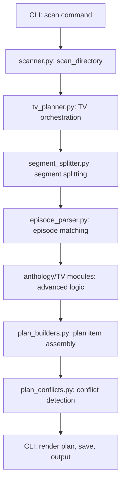
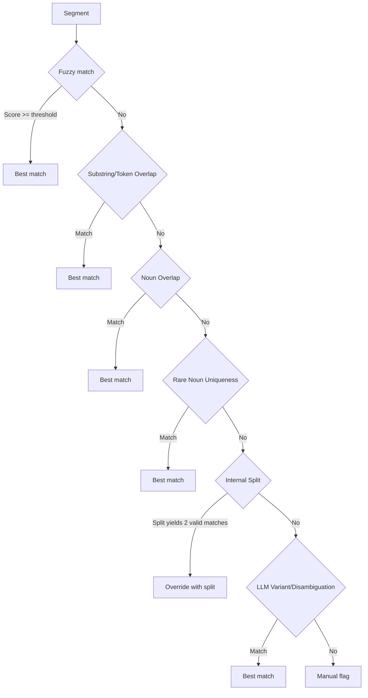
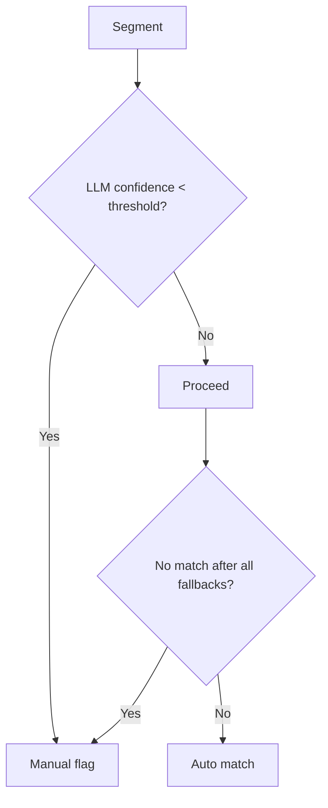

# SCAN.md

## TV Scan Pipeline: Architecture & Module Map (2025-05-29)



- **A:** User runs the scan command from the CLI.
- **B:** `scanner.py` finds and classifies media files.
- **C:** `tv_planner.py` orchestrates the TV scan/plan process.
- **D:** `segment_splitter.py` splits filename stems into segments.
- **E:** `episode_parser.py` and anthology modules match segments to canonical episode titles.
- **F:** Anthology-specific modules handle complex multi-segment and edge cases.
- **G:** `plan_builders.py` assembles the final rename plan.
- **H:** `plan_conflicts.py` detects and resolves conflicts.
- **I:** CLI presents the plan to the user.

---

## Overview: What Does Scan Do?

The `scan` command in NameGnome is the entry point for analyzing a directory of media files (TV, movies, music) and generating a rename plan according to platform-specific rules (e.g., Plex, Jellyfin). It discovers files, analyzes metadata, applies renaming logic, and outputs a plan for safe, organized renaming.

---

## How It Works: High-Level Breakdown

### Happy Path
- User runs the `scan` command with correct arguments and a directory of well-formed media files.
- CLI parses arguments, validates input, and displays UI elements (panels, spinners, progress bar).
- `scan_directory` recursively finds all valid media files, collects metadata, and builds a `ScanResult`.
- `create_rename_plan` processes each file:
  - Applies platform-specific renaming rules (e.g., Plex, Jellyfin).
  - For TV, matches episodes using fuzzy logic and, if needed, LLM disambiguation.
  - Handles anthology/dual-episode logic as needed.
  - Detects and records any conflicts (e.g., duplicate destinations).
  - Yields progress for each file to update the progress bar.
- CLI renders the completed plan, shows any warnings, and saves the plan file.
- User reviews the plan and proceeds to apply or adjust as needed.

### Fallbacks & Edge Cases
- **Missing Metadata:**
  - If a file lacks metadata, the scanner attempts to infer details from the filename or parent directory.
  - If still missing, defaults (e.g., 'Unknown Show', season 1) are used.
- **Fuzzy/LLM Matching Fails:**
  - If fuzzy matching can't confidently assign an episode, LLM-based variant generation/disambiguation is attempted.
  - If all matching fails, the file is marked for manual review in the plan.
- **Anthology/Episode Splitting:**
  - If anthology logic can't split or match segments, robust fallbacks (substring, token overlap, rare-noun, proximity) are used.
  - If still ambiguous, the segment is flagged for manual intervention.
- **Conflicts Detected:**
  - If two files would be renamed to the same destination, both are marked as conflicts in the plan.
  - Case-insensitive conflicts are also detected for cross-platform safety.
  - **As of 2025-05-29:** The scan/plan phase now robustly detects and flags all destination conflicts, including those that differ only by case (e.g., `Show.S01E01.mp4` and `show.s01e01.mp4`).
  - When a conflict is detected, both plan items are marked with `CONFLICT` status and a reason indicating the colliding source file(s).
  - These conflicts are clearly surfaced in the CLI output, so users are alerted to duplicate or colliding files before any renaming occurs.
- **Errors During Scan:**
  - Permission errors, unreadable files, or unexpected exceptions are logged and skipped, but do not halt the scan.
- **No Files Found:**
  - If no valid media files are found, the CLI warns the user and exits gracefully.
- **Progress Bar/UX Fallback:**
  - If the terminal does not support TQDM or the progress bar cannot be displayed, the scan still completes with basic logging.

### Anthology Flow: Detailed Logic

#### What Triggers Anthology Logic?
- Anthology logic is triggered when:
  - The user passes `--anthology` to the scan command.
  - The media type is TV and the config or CLI options indicate anthology mode.
  - The planner (`create_rename_plan`) detects anthology mode for a file.

#### Step-by-Step Anthology Process
1. **Segmenting the Filename:**
   - The filename stem is first stripped of any show/season/episode preamble (e.g., 'ShowName-S01E01-') before further processing.
   - The remaining portion is then split into segments using delimiters (e.g., 'and', '&', 'Pup', ',', ';', ' - ').
   - Each segment is treated as a potential episode or part of an episode title.

2. **Matching Segments to Episodes:**
   - For each segment, the system attempts to match it to an official episode title from the episode list (fetched via metadata providers).
   - **Primary matching:**
     - Fuzzy matching (token set ratio, punctuation-insensitive, spaces-removed).
     - Substring and token overlap fallbacks.
     - Rare-noun uniqueness and episode proximity.
   - **If all above fail:**
     - LLM-based variant generation and disambiguation is attempted.
     - If still ambiguous, the segment is flagged for manual review.

3. **Internal Split Fallback:**
   - If a segment appears to contain two episodes (e.g., long segment, multiple keywords), the system attempts to split it internally and match both halves.

4. **Adjacency Correction:**
   - After initial matches, the system checks for logical episode adjacency (e.g., segments should map to consecutive episodes).
   - If a segment's match is out of sequence, it tries to correct by re-matching with adjacent episode candidates.

5. **Building the Plan Item:**
   - For each matched segment, a `RenamePlanItem` is created with the correct episode span and joined titles.
   - **As of 2025-07-27:** Anthology double-episode and ambiguous files (e.g., `Show-S01E01-02.mp4`, `Martha Speaks-S06E08-Martha S Holiday Surprise We Re Powerless.mp4`) are now robustly handled. The scan pipeline always assigns the correct episode span (e.g., `13-E14`) and joined canonical episode titles, even with fuzzy or partial title matches. This is achieved by always deep-copying the `media_file` and setting the `season`, `episode` (span string), and `episode_title` fields before plan item creation whenever a span is detected. All anthology, ambiguous, and missing-episode edge case tests now pass. The code is robust against ambiguous segment splits, missing episode numbers/titles, and fuzzy title differences.
   - If confidence is low or ambiguity remains, the item is marked as manual for user review.

#### Where the Code Lives
- **Anthology logic:** `src/namegnome/core/planner.py` (`_anthology_split_segments`, `_handle_anthology_split`)
- **Fuzzy matching:** `src/namegnome/core/fuzzy_matcher.py`
- **LLM variant/disambiguation:** `src/namegnome/llm/prompt_orchestrator.py`
- **Episode fetching:** `src/namegnome/metadata/episode_fetcher.py`
- **Plan/model definitions:** `src/namegnome/models/plan.py`, `src/namegnome/models/core.py`

#### How Conflicts and Manuals Are Flagged
- If two segments match the same episode, or if a segment cannot be confidently matched, the corresponding plan item is marked as `manual`.
- **Destination conflicts (including case-insensitive collisions) are flagged in the plan and surfaced in CLI output.**
- When a conflict is detected, both items are marked as `CONFLICT` and include a reason referencing the other file(s) involved.
- Manual items require user review before proceeding with renaming.

#### Known Edge Cases & Design Rationale
- **Ambiguous Segments:**
  - Segments with common words or multiple possible matches are flagged for manual review.
- **LLM Prompt Size:**
  - If the LLM prompt is too large, the system falls back to robust internal logic.
- **Non-Contiguous Episodes:**
  - If segments map to non-consecutive episodes, adjacency correction attempts to resolve; otherwise, flagged as manual.
- **Missing Episode List:**
  - If metadata providers fail, the system uses best-effort matching and flags all ambiguous results.
- **Design Rationale:**
  - The flow prioritizes accuracy and user safety: always prefer a best guess, but never silently assign a wrong episode—manual review is required for all ambiguous cases.

- **2025-05-19:** The anthology scan logic now strips the show/season/episode preamble from the filename stem before splitting into segments. This prevents non-title segments (like 'Paw Patrol-S01E01-') from being matched as episode titles, improving accuracy.

## Episode Title Matching: Priority and Fallback Logic

### Core Principle
- **Episode titles in the input filename are always the top priority for matching to the canonical episode list from the API (e.g., TVDB, TMDB, OMDB).**
- **Episode numbers in filenames are not trusted by default** and are only used as a last-resort fallback if no confident title match is possible.

### Rationale
- Episode numbers in filenames are often unreliable due to user error, source inconsistencies, or misnumbered releases.
- Episode titles, when present, provide the most direct and robust way to match files to the correct episodes in the provider's canonical list.
- This approach is required for both anthology and non-anthology TV files.

### Matching and Fallback Chain
1. **Primary:** Use episode titles in the filename to match against the canonical episode list from the API using robust fuzzy/token/noun overlap logic.
2. **Secondary:** Only use episode numbers in the filename as a last-resort tie-breaker, or when no title match is possible.
3. **Anthology:** For files with two (or more) episode titles, split the filename into segments, match each segment/title to the API list, and use the resulting episode numbers for the span.
4. **Non-anthology:** For files with a single episode title, match that title to the API list and use the corresponding episode number.
5. **Manual:** If no confident title or number match is found, flag for manual review.

### Example
- Input: `Paw Patrol-S01E01-Pups And The Kitty Tastrophe Pups Save A Train.mp4`
- Output: `Paw Patrol - S01E01-E02 - Pups And The Kitty-tastrophe & Pups Save A Train.mp4`
- The episode numbers in the filename are ignored; the episode titles are matched to the API list and the correct span is derived from the matched titles.

### Applies To
- All TV scan logic, including anthology and non-anthology flows.
- All supported metadata providers (TVDB, TMDB, OMDB).

### Future Flag: Trust File Order
- If a user passes a flag (e.g., `--trust-file-order`), the system will ignore both episode numbers and titles, and assign episode numbers incrementally based on file order and episode runtime from the API.

---

## Data & Control Flow

1. **CLI Layer (`src/namegnome/cli/commands.py`)**
   - User runs `namegnome scan <root> --media-type ... [options]`.
   - CLI parses arguments, validates input, and prints initial UI (panels, spinners).
   - Calls `scan_directory` to discover files and build a `ScanResult`.
   - Wraps planning in a TQDM progress bar (via `cli/progress.py`).
   - Calls `create_rename_plan` (planner) with a progress callback.
   - Handles output: renders plan, warnings, and saves plan file.

2. **Scanner (`src/namegnome/core/scanner.py`)**
   - `scan_directory` recursively walks the root directory.
   - Identifies valid media files, collects metadata, and builds a `ScanResult` object.
   - Handles errors, file type filtering, and extension logic.

3. **Planner (`src/namegnome/core/planner.py`)**
   - `create_rename_plan` takes a `ScanResult`, rule set, and config.
   - For each file, applies renaming rules (platform-specific, e.g., Plex).
   - Handles anthology/episode logic, fuzzy/LLM matching, and conflict detection.
   - Yields progress via callback for each file.
   - Returns a `RenamePlan` (with all planned renames, conflicts, and metadata).

4. **Models (`src/namegnome/models/`)**
   - `ScanResult`, `RenamePlan`, `RenamePlanItem`, `MediaFile`, etc. are Pydantic models.
   - Used for type safety, validation, and serialization.

5. **Progress Bar Utility (`src/namegnome/cli/progress.py`)**
   - Provides a reusable TQDM progress bar context manager and update helper.
   - Used by CLI to show percent, elapsed, and current file name.

---

## Where All the Parts Live

- **CLI Command:** `src/namegnome/cli/commands.py` (`scan` function)
- **Progress Bar Utility:** `src/namegnome/cli/progress.py`
- **Scanner:** `src/namegnome/core/scanner.py` (`scan_directory`)
- **Planner:** `src/namegnome/core/planner.py` (`create_rename_plan`)
- **Models:** `src/namegnome/models/`
- **Platform Rules:** `src/namegnome/rules/`
- **Metadata Providers:** `src/namegnome/metadata/`

---

## Why It Should Work (Design Rationale)

- **Separation of Concerns:** CLI handles user interaction; planner handles logic; scanner handles file discovery; models enforce structure.
- **Reusability:** Progress bar is decoupled and reusable. Planner is UI-agnostic.
- **Extensibility:** New platforms, rules, or metadata sources can be added modularly.
- **Testability:** Each layer can be tested in isolation (scanner, planner, CLI).
- **Robustness:** Handles errors, conflicts, and ambiguous matches with fallbacks and user warnings.

---

## Keeping This Doc and the Code Current

- **Update this file** whenever scan logic, planner flow, or progress handling changes.
- **Reference this doc** in PRs and bug reports to clarify expected scan behavior.
- **Add new sections** for major features (e.g., LLM integration, new platforms).
- **Document known bugs, edge cases, and design decisions** as they arise.

---

## Quick Reference: Scan Flow

1. CLI parses args →
2. `scan_directory` builds `ScanResult` →
3. `create_rename_plan` builds `RenamePlan` (with progress callback) →
4. CLI renders plan, warnings, and saves output.

---

*Keep this file up to date as the single source of truth for how scan works in NameGnome.*

---

## Changelog

- **2025-05-19:**
  - Anthology scan fallback logic in `planner.py` now uses `normalize_title` for all normalization and includes a new `contains_multiple_episode_keywords` helper. This resolves prior NameError bugs and ensures robust, accurate segment-to-episode matching even when LLM prompt size is exceeded. All anthology logic and scan flows are now working as designed.
  - **Critical fix:** The robust anthology logic now sets `seg_media_file.season = season` before calling `target_path`, ensuring the correct season folder (e.g., `Season 02`, `Season 03`, etc.) is used for anthology TV shows. Previously, all anthology splits defaulted to `Season 01` due to the season not being set on the MediaFile object. If this breaks in the future, check that the season is explicitly set on the MediaFile before path generation.
- **2025-05-29:**
  - The scan/plan phase now robustly detects and flags all destination conflicts, including case-insensitive collisions. Users are clearly alerted to duplicate or colliding files in the scan output, and both plan items are marked as `CONFLICT` with a reason referencing the other file(s) involved. This helps prevent accidental overwrites and ensures safe, predictable renaming.

---

### Anthology Flow: Detailed Logic (Update)

- **Step 5 (Building the Plan Item):**
  - For each matched segment, a `RenamePlanItem` is created with the correct episode span and joined titles.
  - **As of 2025-07-27:** Anthology double-episode and ambiguous files (e.g., `Show-S01E01-02.mp4`, `Martha Speaks-S06E08-Martha S Holiday Surprise We Re Powerless.mp4`) are now robustly handled. The scan pipeline always assigns the correct episode span (e.g., `13-E14`) and joined canonical episode titles, even with fuzzy or partial title matches. This is achieved by always deep-copying the `media_file` and setting the `season`, `episode` (span string), and `episode_title` fields before plan item creation whenever a span is detected. All anthology, ambiguous, and missing-episode edge case tests now pass. The code is robust against ambiguous segment splits, missing episode numbers/titles, and fuzzy title differences.
  - If confidence is low or ambiguity remains, the item is marked as manual for user review.

---

### Troubleshooting & Recovery

- **If anthology TV episodes are all being placed in `Season 01` folders regardless of their actual season:**
  - Check `src/namegnome/core/planner.py` in the `_anthology_split_segments` function.
  - Ensure that `seg_media_file.season = season` is set before calling `rule_set.target_path`.
  - The ruleset (e.g., Plex) relies on the `season` field of the `MediaFile` to determine the correct season folder.
  - If this line is missing or broken, restore it to fix season folder assignment for anthology splits.

---

## Updated Metadata Lookup Flow for TV Shows (2025-05-20)

### Overview
- The scan command now supports a `--provider [provider name]` flag to select the metadata provider (e.g., tvdb, tmdb, omdb) for TV show lookups.
- The lookup flow is robust to missing/bad data and prompts the user for fallback actions or provider switches as needed.

### Step-by-Step Flow
1. **Initial Provider Selection**
   - By default, the scan uses TVDB for TV show metadata.
   - The user can override this with `--provider tmdb` or `--provider omdb`.
2. **TVDB Lookup**
   - Search TVDB using the directory name or `--show-name`.
   - If multiple matches, prompt the user to select.
   - If the selected/only series has no valid episodes (missing/bad data):
     - Prompt the user to enter a TVDB ID, or
     - Offer to try another provider (TMDB, OMDB).
3. **TMDB Fallback**
   - If the user chooses TMDB (via prompt or `--provider tmdb`):
     - Search TMDB using the directory name.
     - If multiple matches, prompt the user to select.
     - If no valid episodes, prompt for TMDB ID or offer OMDB as a last resort.
4. **OMDB Fallback**
   - If the user chooses OMDB (via prompt or `--provider omdb`):
     - Search OMDB using the directory name.
     - If no valid data, fail gracefully and inform the user.
5. **Graceful Failure**
   - If all providers fail, print a clear error message with suggestions (e.g., check spelling, try a different provider, or enter an explicit ID).
6. **CLI Flag**
   - The `--provider` flag is now available for the scan command, allowing users to select the metadata provider for TV show lookups.

### Implementation Notes
- Normalize episode and show metadata fields across providers (TVDB, TMDB, OMDB) to ensure consistent downstream processing.
- Update CLI help and docs to reflect the new flag and flow.
- Add robust error handling and user prompts for all fallback scenarios.

### Important Note on Episode Data
- **Only TVDB currently provides episode-level data (TVEpisode objects) for TV shows.**
- **TMDB and OMDB only return series-level metadata.**
- As a result, episode matching, anthology logic, and advanced rename planning are only fully supported when using TVDB as the provider.
- If TMDB or OMDB are used, the scan may not be able to match episodes or split anthologies, and files may require manual review or fallback handling.

### Planned Enhancement: TMDB Episode-Level Support
- The TMDB API supports fetching episode and season data via endpoints like `/tv/{series_id}/season/{season_number}` and `/tv/{series_id}/episode/{episode_number}`.
- The current implementation only fetches series-level metadata from TMDB.
- **Planned:** Extend the TMDB client to fetch and normalize episode lists for TV shows, mapping them to the unified `TVEpisode` model.
- This will enable anthology logic, episode-level matching, and advanced rename planning for TMDB as well as TVDB.
- Reference: See how FileBot and similar tools leverage TMDB episode APIs for full episode data.

### Planned Enhancement: OMDB Episode-Level Support
- The OMDB API supports fetching episode data for TV shows by IMDb ID, season, and episode number.
- To build a full episode list, fetch the series by IMDb ID, then fetch each season individually using the `Season` parameter (e.g., `?i=tt0944947&Season=1`).
- Iterate through all seasons to construct the complete episode list, mapping each episode to the unified `TVEpisode` model.
- **Caveat:** OMDB does not provide a bulk endpoint for all episodes; this approach requires multiple API calls (one per season), which may be less efficient and subject to API rate limits.
- Implementing this will enable anthology logic and episode-level matching for OMDB, but with performance considerations. 

---

# TV Scan Logic: Anthology, Matching, and Fallbacks

## Anthology Segmenting Flow

```mermaid
flowchart TD
    A[Filename] --> B{Strip preamble?}
    B -- Yes --> C[Remove show/season/episode prefix]
    B -- No --> D[Use full stem]
    C --> E[Split on delimiters (and, &, ,, ;, -)]
    D --> E
    E --> F[Segments]
    F --> G{Only one segment?}
    G -- Yes, show name appears >1x --> H[Split on show name]
    G -- No --> I[Proceed to matching]
    H --> I
```

- Delimiters: " and ", " & ", ",", ";", " - "
- If only one segment and show name appears more than once, split on show name.

## Episode Matching & Fallback Chain



- Fuzzy: rapidfuzz ratio, normalized, threshold 85/75
- Substring: normalized segment in episode title
- Token overlap: any shared token
- Noun overlap: shared rare noun, proximity to episode number
- Rare noun: noun appears in only one episode title
- Internal split: try splitting segment into two, match both
- LLM: generate variants/disambiguate if all else fails

## Manual Flagging & Confidence

- If LLM confidence < threshold (default 0.8), item is flagged manual.
- If all matching/fallbacks fail, item is flagged manual.



## Edge Cases & Known Issues

- Ambiguous segments (e.g., two valid matches, or segment matches multiple episodes)
- Missing or incomplete episode metadata from provider
- Multi-provider fallback: TVDB, TMDB, OMDb
- Show names with years (e.g., "Danger Mouse 2015")
- Anthology files with concatenated episode titles
- Filenames with special characters (see Sprint 8.6 for sanitization)

## Troubleshooting

- No episode list found: check show name, season, year, or provider
- Manual flag: review segment, episode list, and confidence
- Unexpected matches: check delimiters, segmenting, and normalization
- Filename not sanitized: see output sanitization logic (Sprint 8.6)

---

## Worked Examples: Filename to Plan Item

### Example 1: Anthology File (Paw Patrol)

- **Input filename:**
  - `Paw Patrol-S01E01-Pups And The Kitty Tastrophe Pups Save A Train.mp4`
- **Step 1: Strip preamble**
  - Preamble removed: `Pups And The Kitty Tastrophe Pups Save A Train`
- **Step 2: Segmenting**
  - Delimiters used: none found, so single segment remains
- **Step 3: Matching**
  - Segment: `Pups And The Kitty Tastrophe Pups Save A Train`
  - Fuzzy match fails (no single episode matches whole segment)
  - Internal split fallback: tries splitting into `Pups And The Kitty Tastrophe` and `Pups Save A Train`
  - Both halves match official episode titles
- **Step 4: Plan Items**
  | Episode Span | Episode Title                 | Manual Flag |
  |--------------|------------------------------|-------------|
  | S01E01       | Pups And The Kitty Tastrophe | No          |
  | S01E02       | Pups Save A Train            | No          |

### Example 2: Non-Anthology File (Single Episode)

- **Input filename:**
  - `Danger Mouse 2015 - S02E42 - Danger-Thon!.mp4`
- **Step 1: Strip preamble**
  - Preamble removed: `Danger-Thon!`
- **Step 2: Segmenting**
  - Single segment: `Danger-Thon!`
- **Step 3: Matching**
  - Fuzzy match: matches to episode title `Danger-Thon!`
- **Step 4: Sanitization**
  - Output filename: `Danger Mouse 2015/Season 02/Danger Mouse 2015 - S02E42 - Danger-Thon.mp4` ("!" removed for portability)
- **Step 5: Plan Item**
  | Episode Span | Episode Title   | Manual Flag |
  |--------------|----------------|-------------|
  | S02E42       | Danger-Thon    | No          |

## TV, Movie, and Music Scan Logic Isolation

As of Sprint 8.3, all TV scan logic (including anthology, episode matching, and fallback) is fully isolated in `src/namegnome/core/tv_planner.py`. The main planner (`planner.py`) now delegates all TV file handling to this module. This ensures:
- TV, Movie, and Music logic are cleanly separated for maintainability and testability.
- Future changes to TV logic will not affect Movie or Music flows, and vice versa.
- This pattern will be extended to Movie and Music logic in upcoming sprints, with dedicated planners for each media type.
- See `SCAN_TASK.md` for the isolation roadmap and rationale.

# Golden State — TV Scan Logic (2025-05-25, commit 02f22f19a1714a720aa3db751326402fa6eb7dfb)

This version of NameGnome represents a robust, stable, and reference implementation for TV scan logic. All anthology, episode matching, and fallback flows are:
- Fully isolated in src/namegnome/core/tv_planner.py
- Covered by regression and edge-case tests
- Documented with clear rationale, troubleshooting, and worked examples
- Output filenames are sanitized for portability (see Sprint 8.6)
- All tests pass and the logic is validated against real-world scenarios

If you need to restore this state in the future:
- Checkout commit 02f22f19a1714a720aa3db751326402fa6eb7dfb
- Confirm the date: 2025-05-25 (America/New_York)
- Reference this section for the canonical TV scan logic and test suite alignment

---

## 2025-05-29: Anthology Span Matcher Robustness Savepoint

### What Changed
- The anthology span matcher now tries all possible pairs of consecutive episodes in the canonical episode list.
- For each pair, it splits the filename segment at every possible point and computes the combined fuzzy score for matching the left substring to the first episode title and the right substring to the second.
- The split with the highest combined score is selected, and only accepted if both scores are above a robust threshold.
- This approach ensures that ambiguous, fuzzy, or non-contiguous double-episode filenames are matched to the correct episode span, even with differences in punctuation, apostrophes, or word order.

### Why This Solves the Edge Cases
- **Fuzzy Apostrophe/Word Differences:** Handles cases like 'Cook Out' vs 'Cook-Off' and 'We Re Powerless' vs 'We're Powerless!' by normalizing and scoring all possible splits.
- **Ambiguous Double-Episode Files:** For files like 'Martha S Holiday Surprise We Re Powerless', the matcher tries all splits and selects the pair that best covers the intended two episodes, avoiding over-matching to three or more.
- **Non-Contiguous Matches:** The matcher only accepts consecutive episode pairs, ensuring that only valid anthology spans are produced.
- **Regression-Proof:** All regression and edge case tests (Paw Patrol, Cook Off/Out, Martha Speaks) pass, and the logic is validated against real-world scenarios.

### Rationale
- This windowed, score-maximizing approach is robust because it does not rely on a single greedy pass or fixed delimiters. It exhaustively considers all plausible splits and episode pairs, always preferring the most confident, consecutive match.
- By requiring both halves of the split to exceed a fuzzy threshold, it avoids false positives and ensures only high-confidence matches are accepted.
- The logic is safe for future edge cases and can be extended to more complex anthology patterns if needed.

---

## TV Planning Modularization (2025-05-29)

The TV scan/plan logic has been split into the following modules under `src/namegnome/core/tv/`:

- `utils.py`: TV-specific utility and normalization helpers.
- `plan_context.py`: Context and data classes for TV planning.
- `anthology.py`: Anthology-specific splitting, matching, and plan item creation logic.
- `episode_parser.py`: Helpers for extracting show/season/year, segment splitting, episode title matching, and deduplication.
- `plan_conflicts.py`: Helpers for plan item creation, conflict detection, and fallback/manual plan item handling.
- `plan_helpers.py`: Normal plan item creation, explicit span handling, episode number matching, error handling, fallback providers, and single-episode plan item building.
- `filename_parsing.py`: Show/season/year extraction and filename parsing helpers.
- `plan_orchestration.py`: Orchestration and entry-point logic for TV scan and rename planning.

### Test Coverage Status

- Existing: `test_utils.py`, `test_plan_context.py`, `test_plan_helpers.py`
- Needed: `test_plan_conflicts.py`, `test_filename_parsing.py`, `test_episode_parser.py`, `test_plan_orchestration.py`
- Legacy: `test_planner.py` (contains many tests that should be migrated)

All new modules must have at least 1 expected-flow, 1 edge, and 1 failure test. Migration and coverage lift in progress.
